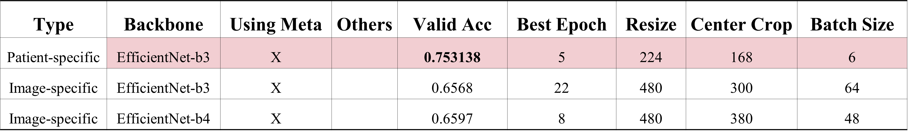

# DTX: 피부병 디지털치료제(DTx-ASM)를 위한 AI 기술 개발
*  DT-PLAT 서비스 제공을 위한 환부 데이터 기반 병명 진단 프레임워크 구현
* 딥러닝 모델로 환자의 환부 이미지 데이터를 학습하여, 환자의 피부병명을 예측하는 모델을 개발 
* 피부병이 존재하는 이미지를 입력 데이터로 받으면 학습된 모델은 해당 이미지에 대한 피부병명을 예측

# 피부병명 분류 모델 개발

## Dataset: Dermatoscopic Photo
* Dermatoscopy로 촬영한 이미지로 classification 모델 학습 및 성능 평가 실험을 진행함. 데이터셋은 학습 데이터 2693개, 검증 데이터 228개, 병명은 총 5개('Actinic keratosis', 'Dermatofibroma', 'Nail disorder', 'Nevus', 'Seborrheic keratosis')로 구성되어 있음 
* 실험에는 ResNet, EfficientNet 모델을 사용하였음. 또한, 이미지뿐만 아니라 환자의 Meta Data(나이, 성별, 발병 부위 등)도 같이 학습했을 때의 성능을 비교함 
* 실험은 이미지 하나하나를 학습하고 예측하는 classification 모델 학습과 같은 환자의 같은 환부 이미지를 Convolutional Nerual Network에 동시에 입력으로 넣어 나온 feature들의 평균값으로 classification 모델을 학습하는 실험(표1의 환자별)을 진행함. 실험 결과, 같은 환자에 대한 이미지의 feature 평균값으로 학습한 모델의 accuracy가 더 높게 나오는 것을 확인함

## Dataset: DSLR Clinic Data
* DSLR로 촬영한 이미지로 classification 모델을 학습하고 예측하는 실험을 진행함. 데이터셋은 학습 데이터 68419개, 검증 데이터 23974개, 병명은 총 9개('Actinic keratosis', 'Fungal infection', 'Vasculitis', 'Eczema', 'Bullous disease', 'Psoriasis', 'Urticaria', 'Connective tissue disease', 'Cellulitis')로 구성되어 있음
* DSLR 이미지의 경우, 여러 질병이 동시에 발병한 사진들이 많아서 다음과 같은 세 가지 세팅으로 실험을 진행
    1. 복수 개의 질환을 진단받은 환자 이미지의 경우, 이미지를 진단 질환 개수만큼 복제 후 각기 다른 레이블을 달아주고, 이 데이터셋으로 Multi-Class Classification 모델을 학습하고 Top-K accuracy를 통해 성능을 비교
    2. 복수 개의 질환을 진단받은 환자 이미지를 제외한 나머지 데이터들을 활용하여 Dermatoscopic Photo 실험에서 사용한 학습방법과 같은 방법으로 실험을 진행
    3. Multi-Label Classification 학습을 진행
* Classification 모델로는 Dermatoscopic Photo와 동일하게 ResNet과 EfficientNet을 사용하였음. DSLR 이미지에 대한 학습에서는 환자의 Meta Data(나이, 성별, 발병 부위 등)를 활용하지 않음

# Quantitative Results

## Dermatoscopic Photo

## DSLR Clinic Data

